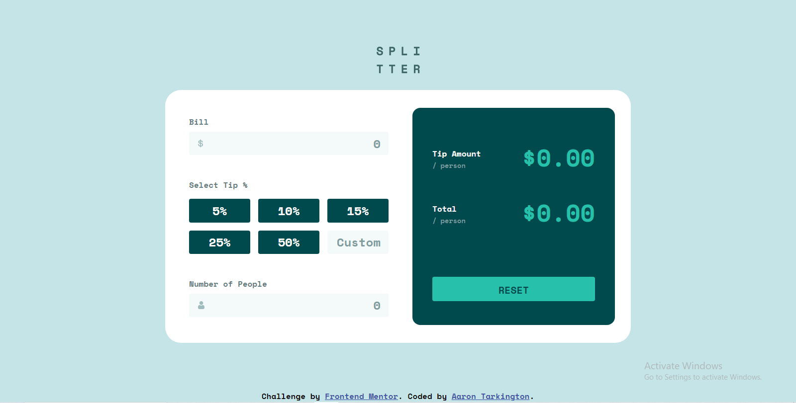

# Frontend Mentor - Tip calculator app solution

This is a solution to the [Tip calculator app challenge on Frontend Mentor](https://www.frontendmentor.io/challenges/tip-calculator-app-ugJNGbJUX). Frontend Mentor challenges help you improve your coding skills by building realistic projects.

## Table of contents

- [Overview](#overview)
  - [The challenge](#the-challenge)
  - [Screenshot](#screenshot)
  - [Links](#links)
- [My process](#my-process)
  - [Built with](#built-with)
- [Author](#author)

## Overview

### The challenge

Users should be able to:

- View the optimal layout for the app depending on their device's screen size
- See hover states for all interactive elements on the page
- Calculate the correct tip and total cost of the bill per person

### Screenshot

### Links

- Solution URL: [link](https://www.frontendmentor.io/solutions/tip-calculator-app-gHA8h3V9IT)
- Live Site URL: [link](https://cdn.discordapp.com/attachments/260975130136543232/1248080267311190086/Frontend-Mentor-Tip-calculator-app_2.png?ex=66645713&is=66630593&hm=2e4d48000d234e4a5b26f2a6d60b8417ad2f20722f7c0fa7ed2a831d2a8ad89b&)

## My process

### Built with

- Semantic HTML5 markup
- CSS custom properties
- Flexbox
- CSS Grid
- Mobile-first workflow

## Author

- Frontend Mentor - [aarontark](https://www.frontendmentor.io/profile/aarontark)
- Instagram - [@whokilledaaronscott](https://www.instagram.com/whokilledaaronscott)